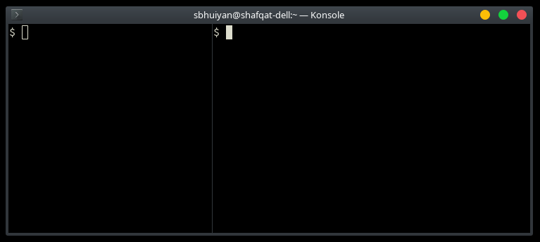

# trigger-await
`trigger` and `await` let you wait for commands between shells.

# Demo



Here we want `./run` to be called as soon as `./build` is finished. So we run the following:

`await built; ./run`

In another shell we can call `./build` then call our trigger:

`./build && trigger built`

Now `./run` will be called straight after `./build` completes successfully.

# Installation

1. Download "trigger" and "await":

```curl --remote-name-all https://raw.githubusercontent.com/priomsrb/trigger-await/master/{trigger,await}```

2. Make them executable:

```chmod +x trigger await```

3. Move them to your PATH. For example:

```
mv trigger await -t ~/bin

# Or

sudo mv trigger await -t /usr/local/bin
```

# Usage

## `await <trigger-name>`

Waits until `<trigger-name>` gets triggered. When `<trigger-name>` is triggered, a message will be printed, a notification shown, and the command will be finished. Can be skipped by pressing Enter.

## `trigger <trigger-name>`

Activates the trigger `<trigger-name>`. Can trigger multiple awaits waiting for the same `<trigger-name>`.

# How it works

`await <trigger-name>` waits until the file `~/.trigger-await/<trigger-name>` is modified.

`trigger <trigger-name>` simply touches `~/.trigger-await/<trigger-name>` to update its modified time.
